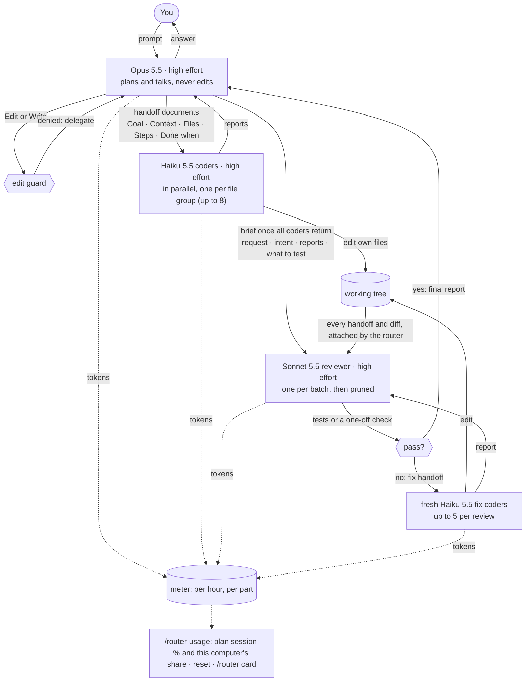

# claude_router

A Claude Code mod (`model-router`) that hard-routes work between models, makes Opus hand work off in a fixed document format, runs Haiku coders in parallel, has Sonnet review every change, and meters tokens per model.

| Role | Model | Enforced by |
|---|---|---|
| Main chat | Opus 5.5, high effort | every main-chat model request is rewritten to `claude-opus-5-5` / `high`; a system-prompt section teaches Opus the protocol |
| File edits | Haiku 5.5, high effort | `Edit`/`Write`/`NotebookEdit` are denied outside `model-router:coder` subagents, which always run on `claude-haiku-5-5` in the foreground |
| Handoff | — | a coder prompt without the headings `## Goal`, `## Context`, `## Files`, `## Steps`, `## Done when` is refused with the template |
| Parallel work | Haiku 5.5 | Opus splits every change by file and spawns one coder per independent file group in one message (usually 1–3), so they run at once; 8 is a hard cap, not a target |
| File locks | — | each coder must list its files (absolute paths under `## Files`) and get its own `## Steps`: the files are locked to that coder, overlapping files or repeated Steps are refused, and a coder cannot edit outside its list |
| Review | Sonnet 5.5, high effort | once every coder of a batch has returned, Opus spawns one `model-router:reviewer` with a brief (request, intent, coder reports, what to test) and the router attaches every handoff and diff; Sonnet runs the tests or a one-off check, sends each failure to fresh Haiku fix coders (handoff documents, up to 5 per review), re-tests until everything passes and reports to Opus; it never edits, and new coders are refused until the batch is reviewed |
| Single-use agents | Haiku 5.5, Sonnet 5.5 | coders and the batch reviewer are fresh sessions, pruned when done: SendMessage to them is refused and they are never compacted; Opus is the only stateful session and the only one auto-compacted |

Effort is set on every request: Opus, Sonnet and Haiku all run at high. Your session's effort setting does not change it.

## How it works



## Requirements

- Claude Code 2.1.292 or newer (the function-hooks plugin API is early access).
- Access to `claude-opus-5-5`, `claude-haiku-5-5` and `claude-sonnet-5-5` on your account.
- `git` on your PATH (the reviewer diffs each coder's files).

## Install

`/plugin` is interactive and exists only in a terminal session: in the VS Code extension it answers `/plugin isn't available in this environment`. The `claude plugin` CLI does the same install from any shell, including VS Code's integrated terminal.

### From GitHub (any shell)

```
claude plugin install model-router --marketplace AndreaScotti01/claude_router --scope user
```

This adds the `claude-router` marketplace to your user settings and installs the plugin. In a terminal Claude Code session the interactive equivalent is `/plugin install model-router --marketplace AndreaScotti01/claude_router` (answer `y` to **Add marketplace?**, then pick the **user** scope).

### From a local clone (no push needed)

```
git clone https://github.com/AndreaScotti01/claude_router.git ~/PycharmProjects/claude_router
claude plugin marketplace add ~/PycharmProjects/claude_router
claude plugin install model-router@claude-router --scope user
```

The plugin is then read from the folder itself (`claude plugin list` shows `Read from: <folder>`): edit it and run `/reload-plugins`, no reinstall.

### Load it without installing (one session)

```
claude --plugin-dir ~/PycharmProjects/claude_router
```

Where no flag can be given (VS Code, SDK hosts), name the folder in `~/.claude/settings.json` and open a new session:

```json
{ "env": { "CLAUDE_CODE_PLUGIN_DIRS": "/absolute/path/to/claude_router" } }
```

### Then

Open a new session (in VS Code: a new Claude Code tab); sessions started before the install do not load it. Do not combine an install with `--plugin-dir` or `CLAUDE_CODE_PLUGIN_DIRS` on the same folder: the plugin would load twice (double metering, double reviews).

## Check it is active

| Check | Terminal | VS Code |
|---|---|---|
| Run `claude plugin list` | shows `model-router@claude-router`, `Status: ✔ enabled` | same (VS Code terminal) |
| Type `/router-usage` | three tables: the account plan limits (5h session and 7-day week, all your devices); **This chat**: the router's usage in the chat you typed it in; **All chats on this computer**: cumulative usage of every chat, open or closed. Each lists the parts (Opus chat, handoff docs, Haiku coders, Sonnet reviews, other subagents) with their % share and the plan points they cost in the session and the week | same |
| Type `/router-usage reset` | clears the router counters for all chats on this computer (one backup kept); the plan % and the learned rate are unaffected | same |
| Ask Claude to change any file | agent rows labelled `Haiku 5.5 · <task>`, then one Sonnet reviewer row (and fix-coder rows if a test failed); Opus relays the review | same |
| Status line `router · today opus 33k · haiku 12k · sonnet 11k` | under the prompt | where the extension shows plugin status lines |
| **Model router** pane: `● model-router active`, model per role, today's tokens, running coders, last review | opens at session start (wide terminals) or with your first prompt | opens with your first prompt |
| Type `/router` | status card (models per role, plan %, today's tokens, running coders, last review) and reopens the pane | status card |

Router usage is stored per hour, per part and per chat in one file, `~/.claude/model-router-usage.json`, shared by every chat on this computer and by every copy of the plugin, and kept for 35 days. It counts only sessions on this computer with the router loaded; the plan % is Anthropic's account-wide reading (all devices, claude.ai, sessions without the router), so the two are shown apart. Each part's share weighs its calls by API list price (cache writes weigh more than output, cache reads little); no amounts are shown. The slice of the plan session is learned each time the plan moves 5+ points while this computer is working; the lowest rate seen is kept, so usage on other devices is left out, and it shows "calibrating" until the first sample (about an hour of steady use). `/router-usage reset` clears the counters but keeps the calibration. Handoff tokens are estimated from document length (4 characters ≈ 1 token).

## Update

- Installed from GitHub: `claude plugin update model-router@claude-router`, then open a new session.
- Installed from a local clone: `git pull` in the folder, then `/reload-plugins` in open sessions.

## Uninstall

```
claude plugin uninstall model-router@claude-router --scope user
claude plugin marketplace remove claude-router
```

## Configure

The models are constants at the top of `hooks/register.tsx`: `MAIN`, `CODER`, `REVIEWER`. Change them, then update the plugin.

## Known limits

- The main chat can still change files through Bash (`sed -i`, heredocs).
- Finished agents stay listed in VS Code's Agent map until Claude Code drops them; the plugin API cannot remove them (they can no longer be resumed).
- A subagent that fills its context is not compacted: it ends, and Opus re-delegates a smaller task.
- Coder bookkeeping lives in memory: a hot reload while a coder runs denies that coder's edits and drops the unreviewed batch (the reviewer then answers "nothing to review"); re-delegate.
- The plugin API is early access; a Claude Code update can break it.

## Develop

```
claude plugin validate .
claude plugin test .
claude --plugin-dir .
tsc -p .   # after the plugin has loaded once (the engine lays .claude-plugin/types/)
```
