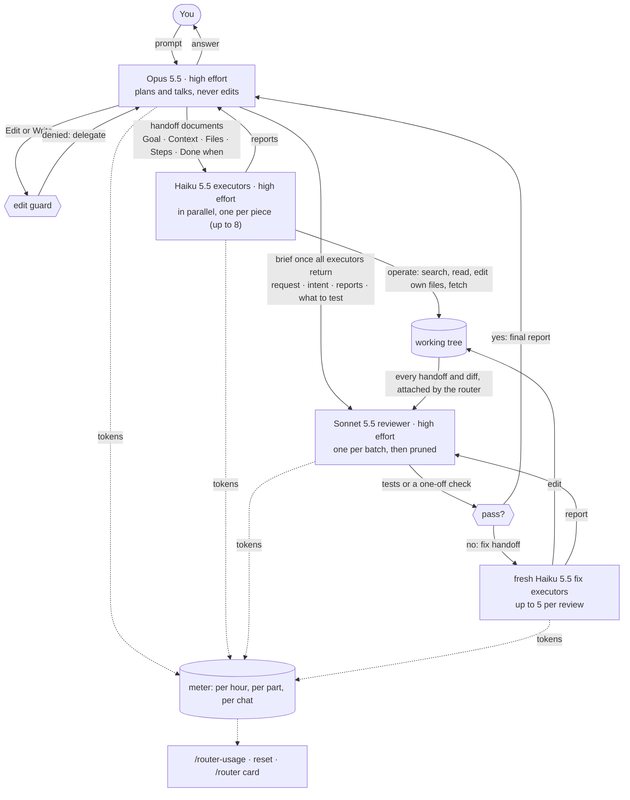

# Claude Router

**Three Claude models working as a team inside Claude Code: one plans, several do the work, one checks it.**

You talk to Claude exactly as before. Behind the scenes, Claude Router splits the work:

| Who | What it does | Think of it as |
|---|---|---|
| **Opus** (the most capable model) | talks with you, plans, and decides what needs doing | the project lead |
| **Haiku** (the fastest, lightest model) | does the hands-on tasks: finds and reads files, edits them, runs commands, looks things up on the web | a team of helpers |
| **Sonnet** | checks every change, runs the tests, and has the helpers fix anything broken | the quality checker |

## Why you'd want it

- **Your plan goes further.** The expensive model spends its time thinking; the light, fast model does the legwork.
- **Work happens in parallel.** Several helpers can work at the same time on separate files.
- **Every change is checked.** A change is reported as done only after the checker has tested it.
- **You can see where your usage goes.** One command shows how much of your Claude plan each model used.

## Before you start

You need:

- **Claude Code**, the terminal app or the VS Code extension, version 2.1.292 or newer. To check, run `claude --version` in a terminal.
- **A Claude plan that includes Opus 5.5, Sonnet 5.5 and Haiku 5.5.**
- **Git.** Most developer computers already have it; check with `git --version`.

## Install (about 2 minutes)

1. **Open a terminal.** On a Mac: the Terminal app. On Windows: PowerShell. In VS Code: menu **Terminal → New Terminal**.
2. **Copy this line, paste it and press Enter:**
   ```
   claude plugin install model-router --marketplace AndreaScotti01/claude_router --scope user
   ```
3. **Start a new Claude Code chat** (in VS Code: open a new Claude Code tab). Chats that were already open don't pick it up.

That's it.

## Check it's working

1. In a new chat, type `/router` and press Enter. You should see a card that starts with **● model-router active** and lists which model does what.
2. Ask Claude to make any small change to a file. While it works you'll see a helper row labelled `Haiku 5.5 · …`, then a Sonnet reviewer row, and Claude tells you what the checker found.

## See where your usage goes: `/router-usage`

Type `/router-usage` in any chat. You get three tables:

1. **Account plan**: how much of your Claude allowance is used right now, across all your devices.
   - *session (5h)*: the allowance that refills every 5 hours
   - *week (7d)*: the weekly allowance
2. **This chat**: what the router used in the chat you're typing in.
3. **All chats on this computer**: the running total for every chat on this computer, open or closed.

In tables 2 and 3, each row is one member of the team:

| Column | What it means |
|---|---|
| **share** | this member's part of the work, weighted by how expensive its model is |
| **≈ of session / ≈ of week** | roughly how many points of your allowance it cost. It says "calibrating" until the router has watched your allowance move a few points, usually within an hour of normal use |
| **in / out** | text the model read / wrote, counted in tokens (a token is roughly ¾ of a word) |
| **cache read / cache write** | earlier conversation the model re-read from its short-term memory (cheap) / saved there for next time |

To start counting from zero, type `/router-usage reset`. Your allowance is not affected: that figure is Anthropic's.

## Update

```
claude plugin update model-router@claude-router
```

Then start a new chat.

## Uninstall

```
claude plugin uninstall model-router@claude-router --scope user
claude plugin marketplace remove claude-router
```

## Common questions

**Do I need to change how I talk to Claude?**
No. Ask as usual; the routing happens on its own.

**Why does Claude say it can't edit files?**
That's the router working: the planner (Opus) hands every edit to a helper (Haiku).

**Does it work in VS Code?**
Yes. The `/plugin` menu only exists in the terminal app, but the install command above works from VS Code's built-in terminal, and everything else works in both.

**Why don't the router's numbers add up to my plan usage?**
Your plan figure counts everything on your account: other computers, claude.ai, and chats without the router. The router's tables count only this computer's chats that have the router turned on.

**Something looks stuck or wrong?**
Type `/reload-plugins`, or start a new chat.

---

## Under the hood

For readers who want to know exactly what the plugin does. It is a Claude Code plugin made of function hooks (`hooks/register.tsx`) that rewrite or refuse model requests and tool calls as they happen.

### Roles and how each is enforced

| Role | Model | Enforced by |
|---|---|---|
| Main chat | Opus 5.5, high effort | every main-chat model request is rewritten to `claude-opus-5-5` / `high`; a system-prompt section teaches Opus the protocol |
| Operations | Haiku 5.5, high effort | Opus hands every well-defined operation (search and read files, map folders, edit, move or create files, run commands, fetch or scrape web pages) to `model-router:executor` subagents, which always run on `claude-haiku-5-5` in the foreground; `Edit`/`Write`/`NotebookEdit` are denied outside executors |
| Handoff | — | an executor prompt without the headings `## Goal`, `## Context`, `## Files`, `## Steps`, `## Done when` is refused with the template |
| Parallel work | Haiku 5.5 | Opus splits work into independent pieces and spawns one executor per piece in one message (usually 1–3), so they run at once; 8 is a hard cap, not a target |
| File locks | — | an executor that changes files lists them (absolute paths in its Files section) and gets its own Steps: the files are locked to it, overlapping files or repeated Steps are refused, and it cannot edit outside its list; an executor with "none" in its Files section is read-only: it locks nothing and cannot edit |
| Review | Sonnet 5.5, high effort | once every executor of a batch has returned, Opus spawns one `model-router:reviewer` with a brief (request, intent, executor reports, what to test) and the router attaches every handoff and diff; Sonnet runs the tests or a one-off check, sends each failure to fresh Haiku fix executors (up to 5 per review), re-tests until everything passes and reports to Opus; it never edits, new executors are refused until the batch is reviewed, and read-only batches need no review |
| Single-use agents | Haiku 5.5, Sonnet 5.5 | executors and the reviewer are fresh sessions, pruned when done: SendMessage to them is refused and they are never compacted; Opus is the only stateful session and the only one auto-compacted |

Effort is set on every request: Opus, Sonnet and Haiku all run at high. Your session's effort setting does not change it.

### Flow



### The handoff document

Every executor starts with no memory of the conversation, so Opus must write it a handoff with five headings, in this order:

- `## Goal`: what the result should be and why
- `## Context`: everything the executor needs to know (paths, URLs, conventions, the user's intent)
- `## Files`: the absolute path of every file it may change, or `none` for read-only work
- `## Steps`: what to do
- `## Done when`: how the executor knows it is finished

Headings count only at the start of a line, so a handoff can mention them in its text.

### Usage metering

- **Where it's stored.** Router usage is kept per hour, per part and per chat in one file, `~/.claude/model-router-usage.json`, shared by every chat on this computer and by every copy of the plugin, for 35 days.
- **Scope.** It counts only sessions on this computer with the router loaded. The plan % is Anthropic's account-wide reading (all devices, claude.ai, sessions without the router), so the two are shown apart.
- **Shares.** Each part's share weighs its calls by API list price (cache writes weigh more than output, cache reads little); no money amounts are shown.
- **Plan points.** The router learns how many plan points one unit of usage costs each time the plan moves 5+ points while this computer is working. It keeps the lowest rate seen, so usage on other devices is left out, and shows "calibrating" until the first sample. `/router-usage reset` clears the counters but keeps this calibration.
- **Handoff tokens** are estimated from document length (4 characters ≈ 1 token) and are part of the Opus chat row.

### What you'll see, in detail

| Check | Terminal | VS Code |
|---|---|---|
| Run `claude plugin list` | shows `model-router@claude-router`, `Status: ✔ enabled` | same (VS Code terminal) |
| Type `/router` | status card (models per role, plan %, today's tokens, running executors, last review) and reopens the pane | status card |
| Type `/router-usage` | the three tables described above | same |
| Ask Claude to change any file | agent rows labelled `Haiku 5.5 · <task>`, then one Sonnet reviewer row (and fix-executor rows if a test failed); Opus relays the review | same |
| Status line `router · today opus 33k · haiku 12k · sonnet 11k` | under the prompt | where the extension shows plugin status lines |
| **Model router** pane: `● model-router active`, model per role, today's tokens, running executors, last review | opens at session start (wide terminals) or with your first prompt | opens with your first prompt |

### Other ways to install

`/plugin` is interactive and exists only in a terminal session; in the VS Code extension it answers `/plugin isn't available in this environment`. In a terminal session the interactive equivalent of the install command is `/plugin install model-router --marketplace AndreaScotti01/claude_router` (answer `y` to **Add marketplace?**, then pick the **user** scope).

**From a local clone (no push needed):**

```
git clone https://github.com/AndreaScotti01/claude_router.git ~/PycharmProjects/claude_router
claude plugin marketplace add ~/PycharmProjects/claude_router
claude plugin install model-router@claude-router --scope user
```

The plugin is then read from the folder itself (`claude plugin list` shows `Read from: <folder>`): edit it and run `/reload-plugins`, no reinstall. To update, `git pull` in the folder, then `/reload-plugins` in open sessions.

**Load it without installing (one session):**

```
claude --plugin-dir ~/PycharmProjects/claude_router
```

Where no flag can be given (VS Code, SDK hosts), name the folder in `~/.claude/settings.json` and open a new session:

```json
{ "env": { "CLAUDE_CODE_PLUGIN_DIRS": "/absolute/path/to/claude_router" } }
```

Do not combine an install with `--plugin-dir` or `CLAUDE_CODE_PLUGIN_DIRS` on the same folder: the plugin would load twice (double metering, double reviews).

### Configure

The models are constants at the top of `hooks/register.tsx`: `MAIN` (Opus), `CODER` (the Haiku executors) and `REVIEWER` (Sonnet). Change them, then update the plugin.

### Known limits

- The main chat can still change files through Bash (`sed -i`, heredocs).
- Read-only executors are held to "no edits" for the Edit and Write tools only; a shell command (`mv`, `rm`) is not checked.
- Finished agents stay listed in VS Code's Agent map until Claude Code drops them; the plugin API cannot remove them (they can no longer be resumed).
- A subagent that fills its context is not compacted: it ends, and Opus re-delegates a smaller task.
- Executor bookkeeping lives in memory: a hot reload while an executor runs denies that executor's edits and drops the unreviewed batch (the reviewer then answers "nothing to review"); re-delegate.
- The plugin API is early access; a Claude Code update can break it.

### Develop

```
claude plugin validate .
claude plugin test .
claude --plugin-dir .
tsc -p .   # after the plugin has loaded once (the engine lays .claude-plugin/types/)
```
