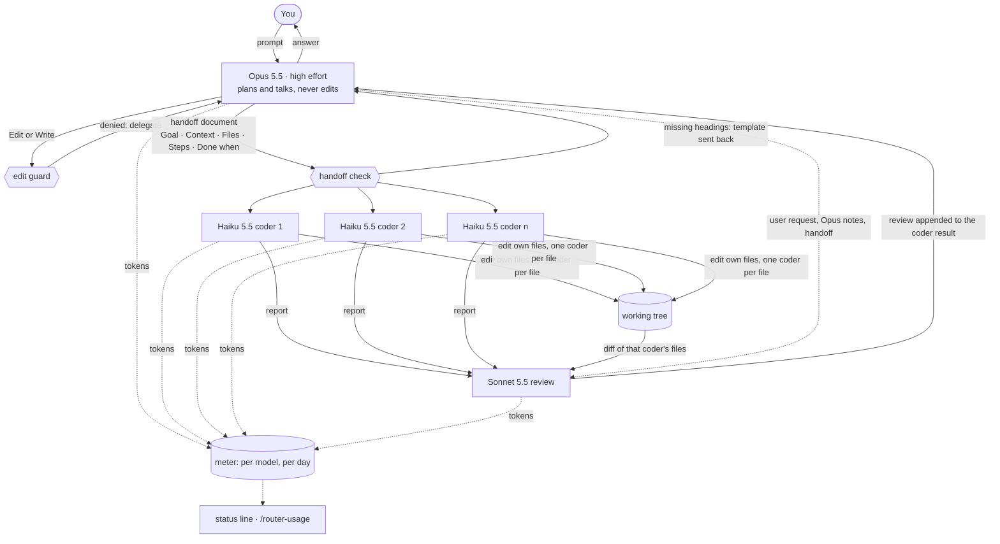

# claude_router

A Claude Code mod (`model-router`) that hard-routes work between models, makes Opus hand work off in a fixed document format, runs Haiku coders in parallel, has Sonnet review every change, and meters tokens per model.

| Role | Model | Enforced by |
|---|---|---|
| Main chat | Opus 5.5, high effort | every main-chat model request is rewritten to `claude-opus-5-5` / `high`; a system-prompt section teaches Opus the protocol |
| File edits | Haiku 5.5 | `Edit`/`Write`/`NotebookEdit` are denied outside `model-router:coder` subagents, which always run on `claude-haiku-5-5` in the foreground |
| Handoff | — | a coder prompt without the headings `## Goal`, `## Context`, `## Files`, `## Steps`, `## Done when` is refused with the template |
| Parallel work | Haiku 5.5 | coders spawned in one message run at once; a file one running coder edits is locked for the others |
| Review | Sonnet 5.5 | after each coder, `claude-sonnet-5-5` reviews the files that coder changed, given the user's request, Opus's notes, the handoff document and the coder's report; the review is appended to the coder's result |

## How it works



## Requirements

- Claude Code 2.1.292 or newer (the function-hooks plugin API is early access).
- Access to `claude-opus-5-5`, `claude-haiku-5-5` and `claude-sonnet-5-5` on your account.
- `git` on your PATH (the reviewer diffs each coder's files).

## Install

### Terminal (recommended)

1. Start Claude Code: `claude`
2. Run:
   ```
   /plugin install model-router --marketplace AndreaScotti01/claude_router
   ```
3. Answer `y` to **Add marketplace?**
4. Pick the **user** scope to use it in every project (or **project** for this repo only).
5. You see `Installed model-router. Plugin is now active.` It runs in that session right away.

### VS Code extension

The `/plugin install` command runs in a terminal session only.

1. Install once from a terminal at the **user** scope (steps above).
2. In VS Code, close any open Claude Code tab and open a new one: sessions started after the install load the plugin.

### From a local clone (development)

```
git clone https://github.com/AndreaScotti01/claude_router.git
claude --plugin-dir ./claude_router
```

Where no flag can be given (VS Code, SDK hosts), name the folder in `~/.claude/settings.json` and open a new session:

```json
{ "env": { "CLAUDE_CODE_PLUGIN_DIRS": "/absolute/path/to/claude_router" } }
```

## Check it is active

| Check | Terminal | VS Code |
|---|---|---|
| Type `/router-usage` | table of tokens per model per day | same |
| Ask Claude to change any file | an agent row labelled `Haiku 5.5 · <task>`; after it, Opus quotes the Sonnet review | same |
| Toast `Sonnet 5.5 review: …` | after each coder | where the extension shows plugin toasts |
| Status line `router · today opus 33k · haiku 12k · sonnet 11k` | under the prompt | where the extension shows plugin status lines |
| Band listing running coders and pending reviews | above the prompt | not drawn: VS Code does not show the above-prompt band |

Usage history is stored in `~/.claude/plugins/store/model-router_*.json`.

## Update

```
claude plugin update model-router
```

Then run `/reload-plugins` in open sessions (or open a new session).

## Uninstall

```
claude plugin uninstall model-router
```

## Configure

The models are constants at the top of `hooks/register.tsx`: `MAIN`, `CODER`, `REVIEWER`. Change them, then update the plugin.

## Known limits

- The main chat can still change files through Bash (`sed -i`, heredocs).
- Coder bookkeeping lives in memory: a hot reload while a coder runs denies that coder's edits; re-delegate.
- The plugin API is early access; a Claude Code update can break it.

## Develop

```
claude plugin validate .
claude plugin test .
claude --plugin-dir .
tsc -p .   # after the plugin has loaded once (the engine lays .claude-plugin/types/)
```
